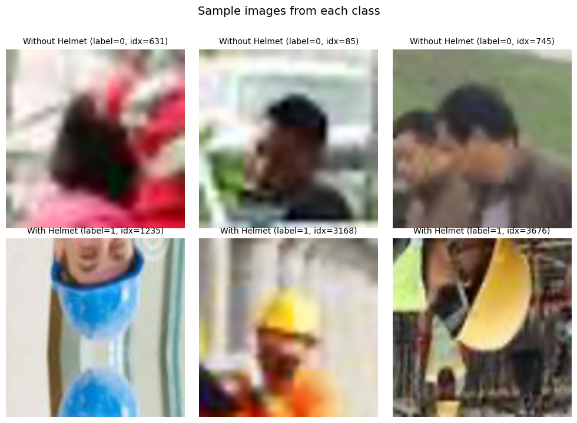
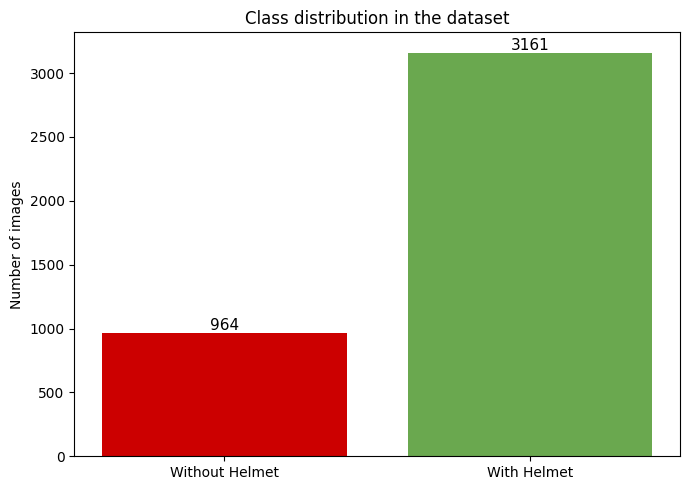
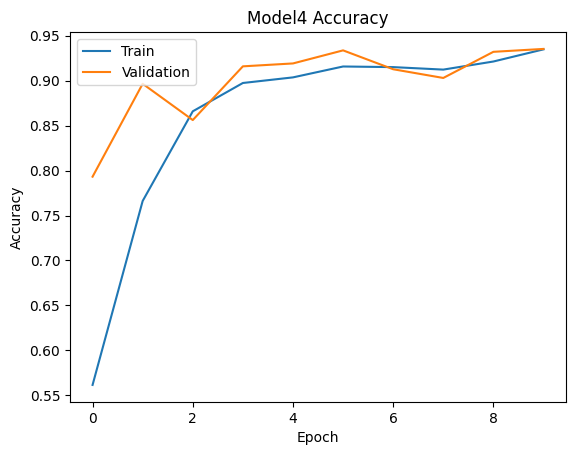
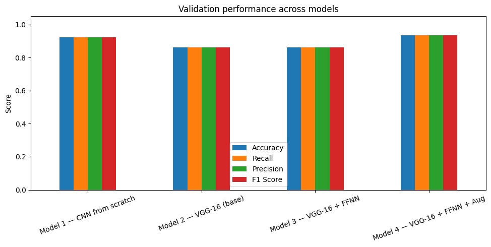
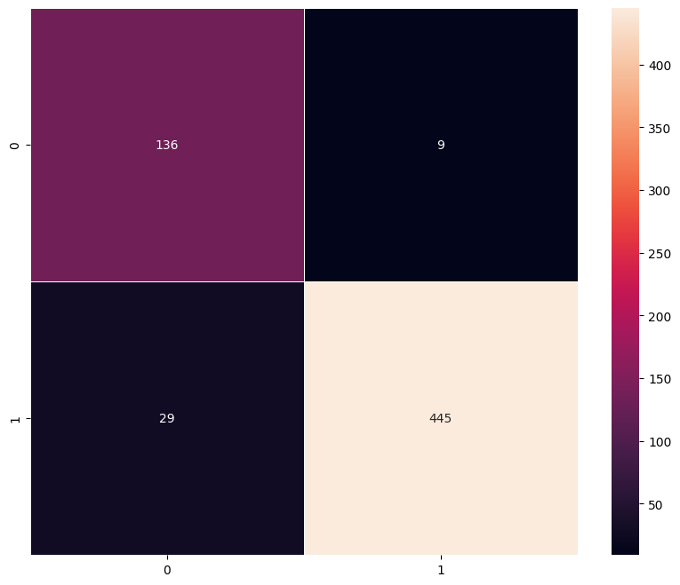

# SafeGuard Corp — Helmet Detection with CNNs 🪖

Image classification project that flags whether a worker in a photo is wearing a safety helmet, built for **SafeGuard Corp** to help automate compliance monitoring on construction sites and industrial plants.

## Problem Statement

Workplace safety in hazardous environments like construction sites and industrial plants is crucial to prevent accidents and injuries. One of the most important safety measures is ensuring workers wear safety helmets, which protect against head injuries from falling objects and machinery. Non-compliance with helmet regulations increases the risk of serious injuries or fatalities, making effective monitoring essential — especially in large-scale operations where manual oversight is prone to error.

**Objective:** build an image classification model that sorts worker photos into one of two categories:

- **With Helmet** — worker is wearing a safety helmet
- **Without Helmet** — worker is not wearing a safety helmet

## Dataset

- **4,125** RGB images, `200 × 200 × 3`
- **With Helmet:** 3,161 images (76.6%)
- **Without Helmet:** 964 images (23.4%) — an imbalance of ~3.3 : 1, handled via class weighting during training
- Images span varied lighting, camera angles, worker postures, and real construction/industrial backdrops

<p align="center">
  <br>
  <em>Sample images from the "With Helmet" and "Without Helmet" classes</em>
</p>

<p align="center">
  <br>
  <em>Class distribution — 964 "Without Helmet" vs. 3,161 "With Helmet" images</em>
</p>

### Train / Validation / Test split

A stratified 70 / 15 / 15 split (fixed seed) preserves the class ratio (~76.6% "With Helmet") across all three sets:

| Split | Images | Without Helmet | With Helmet |
|---|---|---|---|
| Train | 2,887 | 675 | 2,212 |
| Validation | 619 | 144 | 475 |
| Test | 619 | 145 | 474 |

Pixel values are scaled from `[0, 255]` to `[0, 1]`; images are kept in RGB (color cues — helmet color, reflective surfaces, clothing/background contrast — carry useful signal for this task).

## Modeling Approach

Four architectures were trained and compared:

1. **Model 1 — CNN from scratch:** 3 conv/BatchNorm/MaxPool blocks (32 → 64 → 128 filters) feeding a dense classification head.
2. **Model 2 — VGG-16 (base):** frozen `ImageNet`-pretrained VGG-16 convolutional base with a minimal `Flatten → Dense(1, sigmoid)` head.
3. **Model 3 — VGG-16 + FFNN:** frozen VGG-16 base with a deeper feed-forward head (`Dense(256, relu) → Dropout → Dense(1, sigmoid)`) to curb overfitting.
4. **Model 4 — VGG-16 + FFNN + Augmentation:** fine-tuned VGG-16 base + FFNN head, trained with on-the-fly data augmentation (rotation, shift, shear, zoom, horizontal flip) to improve generalization.

<p align="center">
  <br>
  <em>Model 4 (VGG-16 + FFNN + Augmentation) — training vs. validation accuracy over epochs</em>
</p>

## Results

### Training set

| Model | Accuracy | Recall | Precision | F1 Score |
|---|---|---|---|---|
| Model 1 — CNN from scratch | 0.9993 | 0.9993 | 0.9993 | 0.9993 |
| Model 2 — VGG-16 (base) | 0.8933 | 0.8933 | 0.8933 | 0.8933 |
| Model 3 — VGG-16 + FFNN | 0.9210 | 0.9210 | 0.9210 | 0.9210 |
| Model 4 — VGG-16 + FFNN + Aug | 0.9567 | 0.9567 | 0.9567 | 0.9567 |

### Validation set

| Model | Accuracy | Recall | Precision | F1 Score |
|---|---|---|---|---|
| Model 1 — CNN from scratch | 0.9241 | 0.9241 | 0.9241 | 0.9241 |
| Model 2 — VGG-16 (base) | 0.8611 | 0.8611 | 0.8611 | 0.8611 |
| Model 3 — VGG-16 + FFNN | 0.8611 | 0.8611 | 0.8611 | 0.8611 |
| **Model 4 — VGG-16 + FFNN + Aug** | **0.9354** | **0.9354** | **0.9354** | **0.9354** |

Model 1 fits the training data almost perfectly (99.9% accuracy) but shows the largest train/validation gap (7.5 pts), signaling overfitting. Model 4's augmentation strategy closes that gap the most (2.1 pts) while achieving the best validation performance, making it the selected model.

<p align="center">
  <br>
  <em>Validation performance across all four models — Model 4 comes out on top</em>
</p>

### Final test performance (Model 4)

| Accuracy | Recall | Precision | F1 Score |
|---|---|---|---|
| 0.9386 | 0.9386 | 0.9386 | 0.9386 |

<p align="center">
  <br>
  <em>Model 4 — confusion matrix on the held-out test set</em>
</p>

**Model 4 (VGG-16 backbone, fine-tuned + FFNN head + data augmentation) generalizes best**, reaching ~93.9% accuracy on unseen test data while showing the smallest overfitting gap of all four candidates.

## Repository Contents

| File | Description |
|---|---|
| `SafeGuard_Corp.ipynb` | End-to-end notebook: EDA, preprocessing, model building (CNN + VGG-16 variants), training, evaluation, and model comparison |

## Tech Stack

- **TensorFlow / Keras** — model building & training (`Sequential`, `Conv2D`, VGG-16 transfer learning, `ImageDataGenerator`)
- **scikit-learn** — train/val/test splitting, class weighting, classification metrics
- **NumPy / pandas** — data wrangling
- **Matplotlib / Seaborn** — EDA plots, training curves, confusion matrices

## Getting Started

1. Open `SafeGuard_Corp.ipynb` in Jupyter or Google Colab.
2. Install dependencies (first cell):
   ```bash
   pip install tensorflow[and-cuda] scikit-learn==1.6.1 opencv-python==4.12.0.88 seaborn==0.13.2 matplotlib==3.10.0 numpy==2.0.2 pandas==2.2.3
   ```
3. Point `filepath` at your local copy of `images.npy` and `labels.csv`.
4. Run all cells sequentially to reproduce EDA, training, and evaluation.
